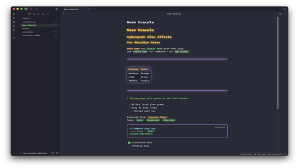

# Neon Dracula

> *A cyberpunk neon theme for [Obsidian](http://obsidian.md)*



---

## // Features

| Element | Color | Effect |
|---------|-------|--------|
| **Headers** | `#ffcc66` Golden | Neon glow + black outline |
| **Inline code** | `#50fa7b` Green | Bright glow |
| **Tables** | `#bd93f9` Purple | Glowing borders |
| **Code blocks** | `#bd93f9` Purple | Glowing borders |
| **Horizontal rules** | `#bd93f9` Purple | Neon glow |
| **Comments** | `#8be9fd` Cyan | Italic + subtle glow |
| **Tags & italics** | `#50fa7b` Green | Neon glow |
| **Links & bold** | `#ffa54f` Orange | Neon glow |
| **Blockquotes** | `#50fa7b` Green | Glowing left border |

---

## // Font Stack

```
Intel One Mono → Fira Code → JetBrains Mono → monospace
```

---

## // Install

### From Obsidian Community Themes

1. **Settings** → **Appearance** → **Manage**
2. Search `Neon Dracula`
3. **Install** → **Use**

### Manual

```bash
# In your vault's .obsidian/themes/ directory
mkdir "Neon Dracula"
# Copy theme.css and manifest.json into that folder
```

---

## // Credits

Based on [Dracula for Obsidian](https://github.com/dracula/obsidian) by [Chrismettal](https://gitlab.com/chrismettal) and [Andy Byers](https://github.com/andybyers21).

---

## // License

[MIT](./LICENSE)
